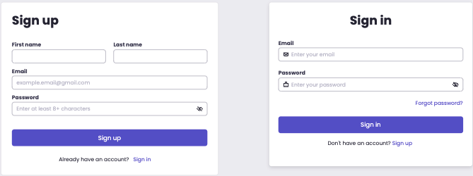
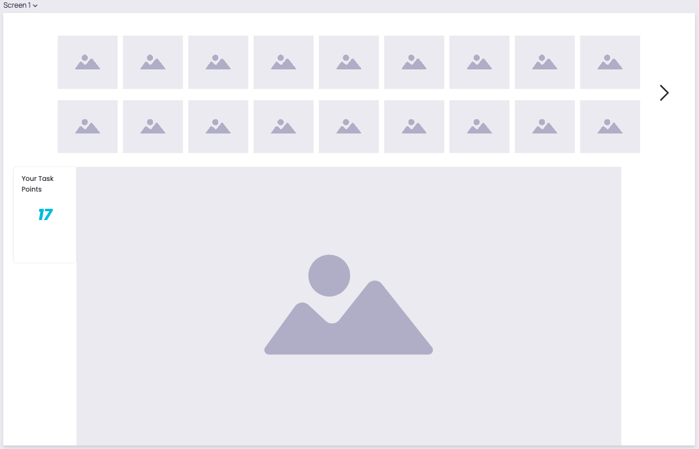
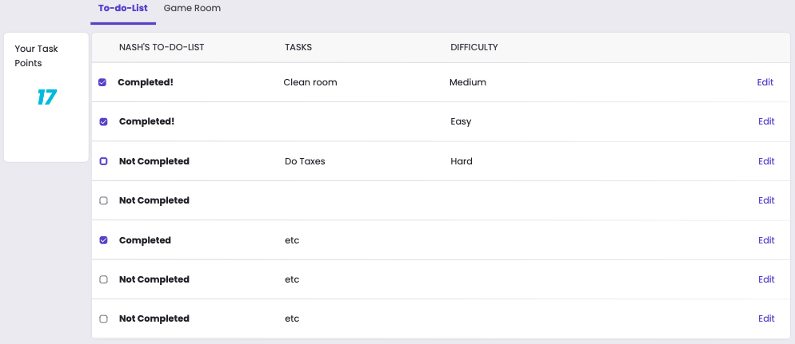
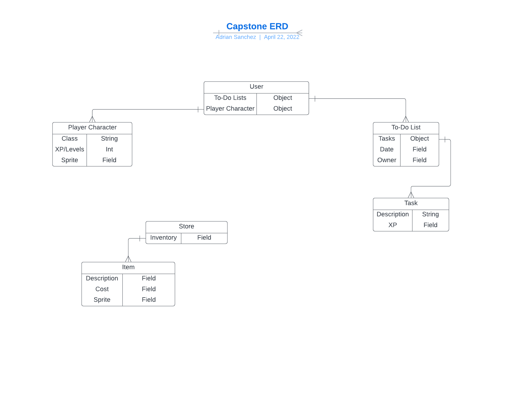

# capstone

---
Turn your life into a game, make your virtual you the coolest guy in the world
## User story

- User should be able to create to-do items and see them in client
- User should be able to check off those to-do's and get points for them
- User should be able to see their bought items in client
- User should be able to spend their points on cosmetics to deck out their crib 

---

## Wire frames
#### potential sign-up/sign-in page

#### potential layout for character and buy screen

#### potential sample list of to-do's 

## ERD

---

## Technologies used

- JavaScript
- React
- MongoDB
- Mongoose
- Express
- Node.js

## Stretch goals
- create more items for character to wear
- create a game that can use the to-do functiosnality to affect in game elements
- sell items for points